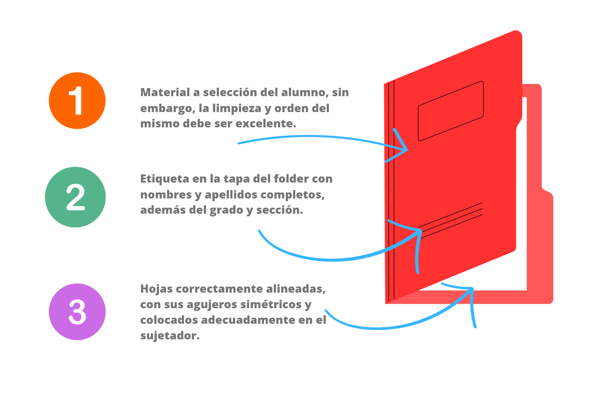

# Página principal - Bienvenida

¡Bienvenidos estudiantes al curso de Computación del año 2023!

Este curso está diseñado para enseñarles las habilidades y el conocimiento necesarios para utilizar las computadoras de manera efectiva y segura. Aprenderán cómo manejar las aplicaciones de software más comunes, cómo navegar por la web, y cómo protegerse de los peligros que se encuentran en línea.

No se olviden que deben esforzarse para poder aprovechar todos los conocimiento ofrecidos durante el desarrollo de clases. Todos y cada uno de ustedes guardan habilidades sorprendentes.

## Calificaciones

El curso consta de las siguientes categorias para las notas.

- **Prácticas:** El desarrollo de las clases será evaluada de manera independiente.
- **Conducta:** Se evaluará el desempeño conductual del estudiante.
- **Tareas:** Se evaluará el aprendizaje del estudiante con proyectos individuales. Se deberá impirmir en **UNA HOJA** juntamente con el título de la clase.
- **Folder:** El folder se usará para archivar las tareas impresas. Cada semana habrá una tarea y su presentación será en la última semana de cada unidad.
- **Práctica Calificada:** Una práctica que te retará a usar todas o la mayoría de habilidades aprendidas en clase.

Las notas seran literales, es decir: AD(Logro destacado), A(Logro previsto), B(En proceso) y C(En inicio)

## Calendarización

La estructura del curso se rige a la calendarización general.

|   **Bimestre**   |   **Inicio**  |     **Fin**     |        **Vacaciones**        |
|:----------------:|:-------------:|:---------------:|:----------------------------:|
| Primer Bimestre  | 06 de Marzo   | 12 de Mayo      | 15 al 19 de Mayo             |
| Segundo Bimestre | 22 de Mayo    | 21 de Julio     | 24 de Julio al 04 de Agosto  |
| Tercer Bimestre  | 07 de Agosto  | 06 de Octubre   | 09 al 13 de Octubre          |
| Cuarto Bimestre  | 16 de Octubre | 21 de Diciembre | A partir del 22 de Diciembre |

Si quieres ver más detallada la calendarización, puedes hacerlo desde este [enlace](https://docs.google.com/spreadsheets/d/e/2PACX-1vQUeMofKJXcNg6xZV_PYlnyIEoM9xmn0y4KA5dlgMDrk3quW5HIBV26MGMRSKOuoISH7YDHgulLgEqu/pubhtml?gid=0&single=true)

## Folder de Computación

EL folder de Computación, como se menciono anteriormente, se usará como archivador de tareas. Para ello se debe tomar en cuenta lo siguiente:

- El material puede ser cualquiera (Desde Manila hasta plastificado).
- Se le dará bastante importancia a la limpieza.
- El folder deberá tener en su parte delantera los nombres y apellidos completos del estudiante, además del grado y sección.
- La presentación será en la fecha indicada, si se presenta de manera posterior la nota bajará drasticamente.

La estructura del folder debe ser la siguiente:

1. **Hoja de Respeto:** Deberá estar sin manchas, ni deterioro por rasgado o doblado.
2. **Carátula del folder:** Una hoja diseñada con los datos del estudiante, grado ,sección, año, curso, colegio y profesor. Si es hecha a mano se recompensará.
3. **Carátula del Bimestre:** Una hoja diseñada con el tema del Bimestre descrito en clase y/o esta página.
4. **Tareas:** Hojas con la captura o resultado de la tarea dejada. Cada tarea debe ir en una sola hoja, juntamente con el número de semana y el título de la clase que corresponde con dicha tarea.

En este [Enlace](https://www.canva.com/design/DAFfLjw1P70/wCCeOXkAOUYoCadJQ-_JNw/view?utm_content=DAFfLjw1P70&utm_campaign=designshare&utm_medium=link&utm_source=publishsharelink) podrás ver un ejemplo del contenido del folder.

## Trabajos hechos a mano

Tener una computadora en casa con conexión a Internet se ha vuelto imprescindible estos días, tanto para labores educativas y de aprendizaje en línea, como para el trabajo. El no tener una se convierte en una dificultad para el correcto aprendizaje del estudiante. Sin embargo, a fin de no perjudicar las notas de los que no tienen una, se les permite desarrollar las tareas a mano.

Los trabajos hechos a mano deberán tomar en cuenta lo siguiente:

- **Ortografía y Gramática:** Todo texto escrito deberá ser entendible y respetar las reglas de nuestro lenguaje.
- **Uso de plumones:** No se recomienda el uso de plumones ya que manchan los trabajos, se pueden diluir por el calor, etc. Si los usas toma en cuenta esto, ya que de eso dependerá tu nota.
- **Lapices de colores:** Los lapices de colores son perfectos para el pintado, pero debes usarlos correctamente [Video](https://www.youtube.com/watch?v=UMNwTIs8FJw). No los presiones mucho y respeta las líneas.
- **Líneas:** Si tu pulso no es adecuado, lo mejor es que uses una regla para el trazado de líneas rectas.

## Resolución de dudas

La resolución de dudas se harán en clase, si hubiera alguna duda que no haya sido tocado en clase, enviar un mensaje por el chat adjunto.
